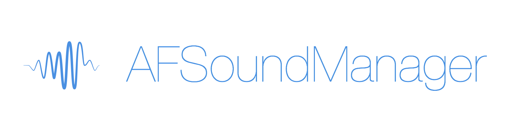

AFSoundManager v2
==============

[](https://travis-ci.org/AlvaroFranco/AFSoundManager)
[]()
[]()




iOS audio playing (both local and streaming) and recording made easy through a complete and block-driven Objective-C class. AFSoundManager uses AudioToolbox and AVFoundation frameworks to serve the audio.

##Installation

###CocoaPods

AFSoundManager is available on CocoaPods so you can get it by adding this line to your Podfile:

	pod 'AFSoundManager'

###Manual

If you don't use CocoaPods, you will have to import these files into your project:

	AFSoundManager.h
	AFSoundPlayback.h
	AFSoundPlayback.m
	AFSoundItem.h
	AFSoundItem.m
	AFSoundQueue.h
	AFSoundQueue.m
	AFSoundRecord.h
	AFSoundRecord.m
	NSTimer+AFSoundManager.h
	NSTimer+AFSoundManager.m
	
Also, you need to import AVFoundation, AudioToolbox and MediaPlayer frameworks.

##Roadmap

Since the v2.0 is a very first version, there's a lot of work remaining. This is a sneak peek of what's coming soon:

* [ ] Integration with Control Center and Locked Screen controls
* [x] Improve data returning to give the developer more data about the current playing
* [ ] A brand new class to let AFSoundPlayback handle real time effects like delay, a customized EQ, etc.
* [ ] AFSoundManager-ready UI controls to integrate a fulfilled play control in your app at a glance, powered by AFSoundManager.

##Usage

###Playing a sound

```AFSoundItem``` will take care of any sound item, and it will be handled by ```AFSoundPlayback```. The ```AFSoundItem``` will contain the location and the metadata of each sound, song, chapter, etc.

```objc
AFSoundItem *item = [[AFSoundItem alloc] initWithLocalResource:@"demo.mp3" atPath:nil];
    
AFSoundPlayback *player = [[AFSoundPlayback alloc] initWithItem:item];
	
[player play];

[_queue listenFeedbackUpdatesWithBlock:^(AFSoundItem *item) {
        
    NSLog(@"Item duration: %ld - time elapsed: %ld", (long)item.duration, (long)item.timePlayed);
} andFinishedBlock:^(void) {
        
    NSLog(@"Track finished playing");
}];

```

###Playing a queue

So, an ```AFSoundItem``` object can be played individually, but it can also be part of a queue, managed by ```AFSoundQueue```.

```objc

AFSoundItem *item1 = [[AFSoundItem alloc] initWithLocalResource:@"demo1.mp3" atPath:nil];
AFSoundItem *item2 = [[AFSoundItem alloc] initWithLocalResource:@"demo2.mp3" atPath:nil];
AFSoundItem *item3 = [[AFSoundItem alloc] initWithLocalResource:@"demo3.mp3" atPath:nil];

AFSoundQueue *queue = [[AFSoundQueue alloc] initWithItems:@[item1, item2, item3]];
[queue playCurrentItem];

[_queue listenFeedbackUpdatesWithBlock:^(AFSoundItem *item) {
        
    NSLog(@"Item duration: %ld - time elapsed: %ld", (long)item.duration, (long)item.timePlayed);
} andFinishedBlock:^(AFSoundItem *nextItem) {
        
    NSLog(@"Finished item, next one is %@", nextItem.title);
}];

```

The block will be executed each 1 second, returning a dictionary with info about the current item. **Expect more info returned by the block in future releases**, like the current item object (```AFSoundItem```), current queue index, etc.

###Current playing actions

####Standard

```objc
-(void)play;
-(void)pause;
-(void)restart;
-(void)playAtSecond:(NSInteger)second;
```

####Queue

```objc
-(void)playCurrentItem;
-(void)pause;
-(void)playNextItem;
-(void)playPreviousItem;
-(void)playItem:(AFSoundItem *)item;
-(void)playItemAtIndex:(NSInteger)index;
```

###Managing a queue

To manage a queue, you can both add items with ```-addItem:``` or ```addItem:atIndex:``` or remove items from the current queue with ```-removeItem:``` and ```-removeItemAtIndex:```


###Fetching metadata

Since you'll be working with ```AFSoundItem``` to manage your tracks, you can obtain the metadata related like the ```title```, ```album```, ```artist``` and ```artwork```.

[_queue listenFeedbackUpdatesWithBlock:^(AFSoundItem *item) {
        
    NSLog(@"Item duration: %ld - time elapsed: %ld", (long)item.duration, (long)item.timePlayed);
} andFinishedBlock:^(AFSoundItem *nextItem) {
        
    NSLog(@"Finished item, next one is %@, by %@ album from the album %@", nextItem.title, nextItem.artist, nextItem.album);
    
    [self updateArtwork:nextItem.artwork];
}];

###Recording a sound

As the previous version, ```AFSoundManager``` lets you record sound quickly thanks to ```AFSoundRecord```:

```objc
AFSoundRecord *recorder = [[AFSoundRecord alloc] initWithFilePath:[NSSearchPathForDirectoriesInDomains(NSDocumentDirectory, NSUserDomainMask, YES) objectAtIndex:0]];

[recorder startRecording];
```

##License
AFSoundManager is under MIT license so feel free to use it!

##Author
Made by Alvaro Franco. If you have any question, feel free to drop me a line at [alvarofrancoayala@gmail.com](mailto:alvarofrancoayala@gmail.com)
